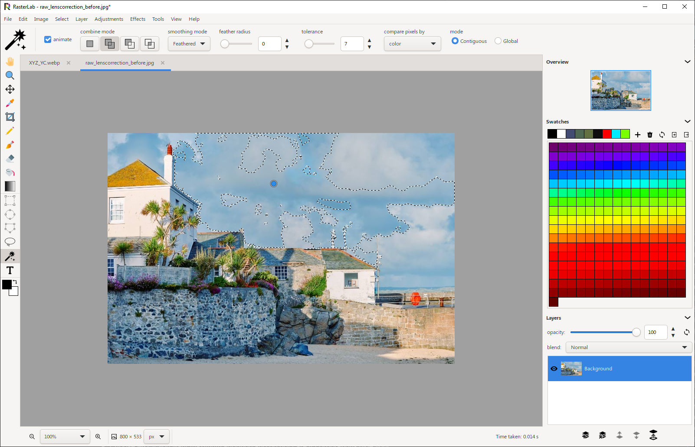
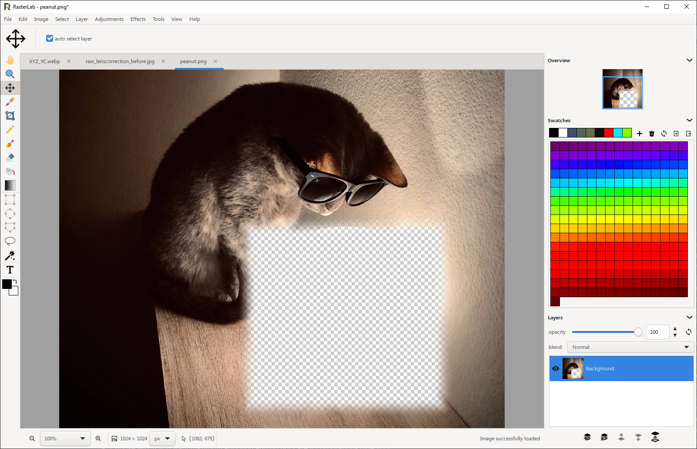
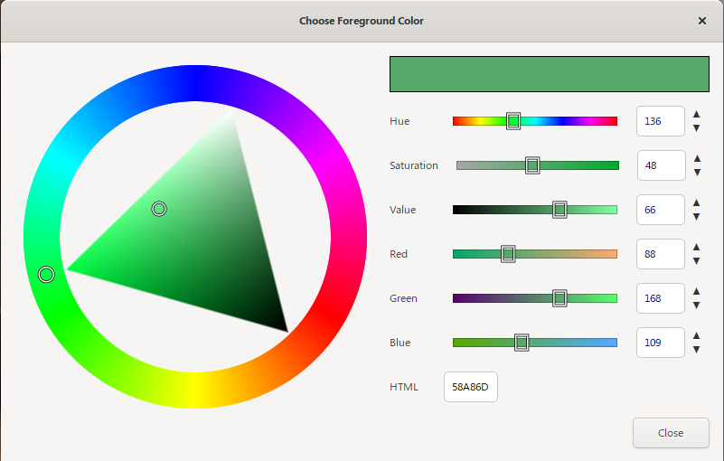
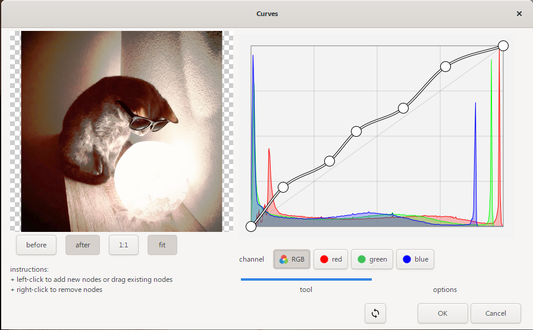
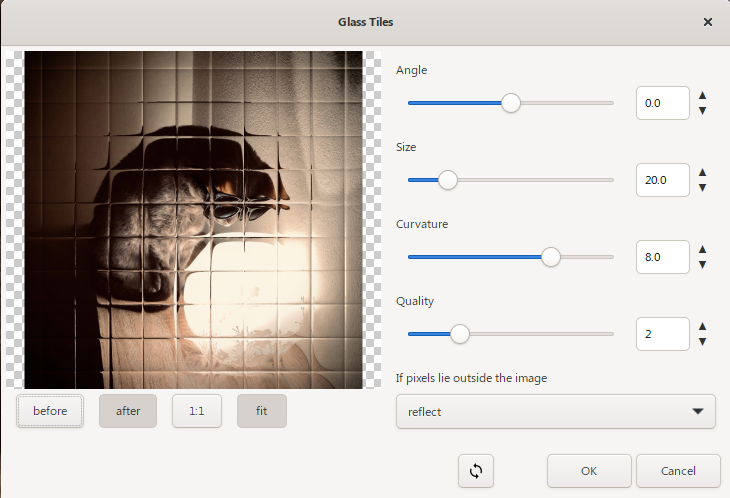

# RasterLab

A full-featured layered image editor written entirely C. It opens and saves a wide range of formats, including a native multi-layer `.rli` file, and includes drawing tools, text, selections, and 80+ adjustments and effects.

I spent a lot of time on performance: tile-based compositing with mipmaps, multi-threaded workers, and optional GPU acceleration so large images stay responsive.

This is still under active development. Do not use it for production work; there may still be bugs.

## Screenshots







## Supported File Formats

| Format                                            | Extensions                                                                                                                                                                                                                     | Read/Write  | Color / notes                                                                                                          | Implementation   |
| ------------------------------------------------- | ------------------------------------------------------------------------------------------------------------------------------------------------------------------------------------------------------------------------------ | ----------- | ---------------------------------------------------------------------------------------------------------------------- | ---------------- |
| RasterLab Image                                   | `.rli`                                                                                                                                                                                                                         | Read, Write | Native layered format (raster + text, ICC)                                                                             | Native           |
| Portable Network Graphic                          | `.png`                                                                                                                                                                                                                         | Read, Write | RGB, RGBA                                                                                                              | libpng           |
| Joint Photographic Experts Group                  | `.jpg`, `.jpeg`                                                                                                                                                                                                                | Read, Write | RGB only (no alpha)                                                                                                    | libjpeg-turbo    |
| Windows Bitmap                                    | `.bmp`                                                                                                                                                                                                                         | Read, Write | RGB, RGBA                                                                                                              | Native           |
| Google WebP Image                                 | `.webp`                                                                                                                                                                                                                        | Read, Write | RGB, RGBA; animated (read as layers, save static only)                                                                 | libwebp          |
| Tagged Image File Format                          | `.tif`, `.tiff`                                                                                                                                                                                                                | Read, Write | RGB, RGBA, multipage                                                                                                   | libtiff          |
| Netpbm - Portable Pixmap/Graymap/Bitmap/Arbitrary | `.ppm`, `.pgm`, `.pbm`, `.pam`, `.pnm`                                                                                                                                                                                         | Read only   | PBM (1-bit), PGM (grayscale), PPM (RGB), PAM (RGBA)                                                                    | Native           |
| True Vision Targa                                 | `.tga`                                                                                                                                                                                                                         | Read only   | RGB, RGBA                                                                                                              | Native           |
| Silicon Graphics Image                            | `.rgb`, `.rgba`, `.sgi`, `.bw`, `.int`, `.inta`                                                                                                                                                                                | Read only   | RGB, RGBA, grayscale                                                                                                   | Native           |
| Sun Raster Image                                  | `.ras`, `.sun`                                                                                                                                                                                                                 | Read only   | RGB, RGBA                                                                                                              | Native           |
| ZSoft Paintbrush                                  | `.pcx`                                                                                                                                                                                                                         | Read only   | RGB (no alpha)                                                                                                         | Native           |
| X PixMap                                          | `.xpm`                                                                                                                                                                                                                         | Read only   | RGB, RGBA (indexed)                                                                                                    | Native           |
| X Bitmap                                          | `.xbm`, `.h`                                                                                                                                                                                                                   | Read only   | 1-bit monochrome                                                                                                       | Native           |
| Dr. Halo                                          | `.cut`                                                                                                                                                                                                                         | Read only   | RGB (no alpha)                                                                                                         | Native           |
| TVPaint IFF DEEP Image                            | `.deep`                                                                                                                                                                                                                        | Read only   | RGB, RGBA                                                                                                              | Native           |
| Radiance RGBE                                     | `.hdr`, `.rgbe`, `.zyze`, `.pic`                                                                                                                                                                                               | Read only   | HDR RGB (no alpha)                                                                                                     | Native           |
| Flexible Image Transport System                   | `.fits`, `.fit`, `.fts`                                                                                                                                                                                                        | Read only   | RGB / grayscale                                                                                                        | Native           |
| Kodak Photo CD                                    | `.pcd`                                                                                                                                                                                                                         | Read only   | All resolutions                                                                                                        | Native           |
| DICOM                                             | `.dcm`, `.dicom`                                                                                                                                                                                                               | Read only   | Medical; JPEG frames use libjpeg-turbo                                                                                 | Native           |
| High Efficiency Image Format                      | `.heic`, `.heif`                                                                                                                                                                                                               | Read, Write | RGB, RGBA; multiframe                                                                                                  | libheif          |
| AV1 Image File                                    | `.avif`, `.avifs`                                                                                                                                                                                                              | Read, Write | RGB, RGBA                                                                                                              | libheif (libaom) |
| OpenEXR                                           | `.exr`                                                                                                                                                                                                                         | Read only   | HDR; RGB, RGBA; Y/RY/BY (luminance+chroma) with optional 2×2 subsampling; Y-only grayscale; scanline and tiled storage | OpenEXR          |
| JPEG XL                                           | `.jxl`                                                                                                                                                                                                                         | Read, Write | RGB, RGBA                                                                                                              | libjxl           |
| Graphics Interchange Format                       | `.gif`                                                                                                                                                                                                                         | Read, Write | RGB, RGBA; animated (read as layers, save static only)                                                                 | Native           |
| Camera Raw                                        | `.cr2`, `.cr3`, `.crw`, `.dng`, `.nef`, `.nrw`, `.orf`, `.rw2`, `.raf`, `.raw`, `.sr2`, `.srw`, `.arw`, `.srf`, `.pef`, `.ptx`, `.x3f`, `.3fr`, `.fff`, `.dcr`, `.kdc`, `.dcs`, `.iiq`, `.mef`, `.mos`, `.mrw`, `.rwl`, `.erf` | Read only   | RGB, RGBA                                                                                                              | LibRaw           |

## Features

### File Operations

- New, open, save, save as, revert, close, and close all
- Open and save images in the formats listed above
- Import from clipboard
- Export palette, 3D LUT, and ICC profile
- Multi-document support with tabbed interface
- Autosave / file recovery
- Recent files tracking

### Drawing Tools

- **Hand** - Pan around the canvas
- **Zoom**
- **Move** - Move layers within the canvas
- **Pencil** - Pixel drawing with optional antialias and grid snap
- **Brush** - Paint with size, opacity, hardness, flow, and spacing
- **Eraser** - Erase with brush-like settings
- **Paint Bucket**
- **Rectangle / Ellipse / Polygon / Lasso Select**
- **Magic Wand**
- **Color Picker**
- **Crop**
- **Text**
- **Gradient** w/ Gradient Editor (supports GIMP `.ggr`, Photoshop `.grd`, native Rasterlab `.rgr`, SVG)

### Edit

- Undo, redo, and undo history
- Cut, copy, and paste (including merged and paste as new image)
- Clear and fill

### Layers

- Image and text layers
- Create, delete, duplicate, and reorder layers
- Layer opacity and visibility controls
- **27 Blend Modes**: Normal, Dissolve, Darken, Multiply, Color Burn, Linear Burn, Darker Color, Lighten, Screen, Color Dodge, Linear Dodge, Lighter Color, Overlay, Soft Light, Hard Light, Vivid Light, Linear Light, Pin Light, Hard Mix, Difference, Exclusion, Subtract, Divide, Hue, Saturation, Color, Luminosity
- Merge up, merge down, merge visible, and flatten image

### Selection

- Pixel-based selection masks
- Tools: rectangle, ellipse, polygon, lasso, magic wand
- Combine modes: New, Add, Subtract, Intersect
- Feathering and antialiasing
- Select all, none, invert
- Grow, shrink, border, feather, sharpen
- Marching ants visualization

### Image

- Resize image and canvas (9 anchor points)
- Fit canvas to active layer or around all layers
- Crop to selection, trim to borders
- Rotate 90 / 180 / arbitrary, flip horizontal/vertical, transpose
- Duplicate document
- Merge visible layers and flatten image

### Adjustments & Effects

About 80 filters, grouped as in the menus:

- **Auto**: Contrast, Gamma, Levels, Threshold, White Balance
- **Color**: Channel Mixer, Color Balance, White Balance, Color Lookup (3D LUT), Chroma Key, HSL, Temperature, Vibrance, Sepia, Shadows/Highlights Tint, Split Toning
- **Histogram**: Equalize, Stretch
- **Lighting**: Backlight, Brightness/Contrast, Curves, Dehaze, Exposure, Gamma, Retinex, Shadows/Highlights
- **Map**: Palette map
- **Other adjustments**: Grayscale, Invert, Monochrome, Posterize, Threshold
- **Artistic**: Film Grain, Frosted Glass, Glass Tiles, Marble, Oil Paint, Relief
- **Blur**: Average, Box, Exponential, Gaussian, Median, Motion, Radial, Surface, Zoom
- **Distort**: Kaleidoscope, Lens Correction, Pinch, Polar Coordinates, Ripple, Spherize, Twirl, Wave
- **Edge**: Canny, Gradient, Laplacian, Prewitt, Roberts, Sobel
- **Noise**: BEEPS, Bilateral, Despeckle, Guided, Skin Smooth
- **Stylize**: Portrait Glow, Kuwahara
- **Pixelate**: Color Halftone, Crystallize, Fragment, Mosaic, Pointillize
- **Sharpen**: Sharpen, Unsharp Mask
- **Other**: Dilate, Erode, Min, Max, High Pass, Custom convolution
- **Render**: Clouds

### View

- Zoom 1% to 3200%, fit on screen, actual pixel size
- Rulers, smart guides, snap to canvas / centerlines / layers
- Status bar and layer-edge overlay

### Color Management

- Little CMS: ICC on load/save, display profile (system / custom / off), rendering intents
- HDR open uses tone mapping (linear, filmic, Drago, Reinhard)

### Undo/Redo

- Disk-backed undo journal with LZ4 compression
- Undo history dialog
- Full undo/redo support for all operations

### Rendering

- Tile-based compositing with mipmaps
- Multi-threaded tile processing
- Optional GPU compositing (GLFW)

### User Interface

- Collapsible workspace: Layers, Tools, Tool Options, Overview, Swatches
- Tool options panel with real-time parameter adjustment
- Real-time preview of Adjustment/Effects filters
- Settings, UI language (currently English, Spanish)
- Rulers, Smart Guides
- Optional canvas/layer edge snapping
- Optionally Show layer edge boundaries when outside canvas (View → Show Layer edges
- Session debug logs (under `debug/` next to the executable; Tools → Developer)
- Optional GPU debug overlay

## Building

CMake 3.16+, a C99/C++17 compiler, pkg-config, GTK 3, libxml2, LZ4, FreeType, and Fontconfig. Clone with submodules:

```bash
git clone --recursive https://github.com/warrengalyen/RasterLab.git
cd RasterLab
```

The binary is `bin/rasterlab` (`bin/rasterlab.exe` on Windows).

### Windows (MSYS2)

From a UCRT64 or MINGW64 shell:

```bash
pacman -S --needed mingw-w64-ucrt-x86_64-gcc mingw-w64-ucrt-x86_64-cmake \
  mingw-w64-ucrt-x86_64-pkgconf mingw-w64-ucrt-x86_64-gtk3 \
  mingw-w64-ucrt-x86_64-libxml2 mingw-w64-ucrt-x86_64-lz4 \
  mingw-w64-ucrt-x86_64-freetype mingw-w64-ucrt-x86_64-fontconfig \
  mingw-w64-ucrt-x86_64-gettext git
```

```bash
cmake -S . -B build -DCMAKE_BUILD_TYPE=Release
cmake --build build
```

On MINGW64, use `mingw-w64-x86_64-*` package names instead.

### Linux

```bash
sudo apt install build-essential cmake pkg-config git \
  libgtk-3-dev libxml2-dev liblz4-dev libfreetype6-dev libfontconfig1-dev \
  libgl1-mesa-dev
cmake -S . -B build -DCMAKE_BUILD_TYPE=Release
cmake --build build
```

### macOS

```bash
brew install cmake pkg-config gtk+3 libxml2 lz4 freetype fontconfig
cmake -S . -B build -DCMAKE_BUILD_TYPE=Release
cmake --build build
```

`-DRASTERLAB_APP_ONLY=ON` uses system image libraries instead of those in `lib/`. `-DBUILD_TESTING=ON` builds unit tests.

## License

[GNU General Public License v3.0](LICENSE)
